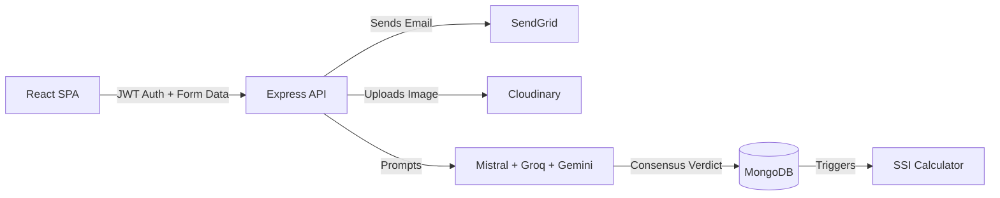

# SafeStay (formerly DormWatch) - Technical Project Summary

*This document contains verified, factual metrics and architectural details extracted directly from the codebase to assist in generating accurate resume bullet points.*

---

## 1. Project Overview
**SafeStay** (originally built as *DormWatch*) is a verified, student-driven safety intelligence platform for student housing in India. It solves the problem of misleading housing reviews and hidden safety hazards (e.g., food poisoning, lack of security, bad water quality) by replacing static reviews with a dynamic, AI-verified trust engine. Verified students submit hazard reports with photo evidence, which directly penalizes a property's dynamic safety score until the owner resolves it. 

**Deployment Status:** Live 
- Frontend: `https://dormwatch-six.vercel.app/`
- Backend: `https://dormwatch-backend.onrender.com`

---

## 2. Tech Stack

### Frontend
- **Framework / Runtime:** React 19.2.3 (via Vite 7.2.4)
- **Language:** TypeScript
- **Styling:** Tailwind CSS 3.4.19, Framer Motion 12.40.0
- **Routing:** React Router v7.13.0
- **State Management:** React Context API (custom `AuthContext`)
- **Key Libraries:** `react-leaflet` (Mapping), `react-hook-form` & `zod` (Validation), `recharts` (Data Viz), `shadcn/ui` components.

### Backend
- **Framework:** Node.js with Express.js 5.2.1
- **API Style:** REST API
- **Key Libraries:** `jsonwebtoken`, `bcryptjs`, `cloudinary`, `@sendgrid/mail`, `multer`

### Database
- **Type:** NoSQL (MongoDB Atlas)
- **ODM:** Mongoose 9.1.6
- **Schema Complexity:** 5 core collections (`User`, `Accommodation`, `Report`, `CounterReport`, `OTP`). Includes geospatial indexing (`2dsphere`) for location queries.

### AI / ML Integration
- **Purpose:** Parallel verification of user-submitted safety hazard reports to prevent spam and validate photographic evidence.
- **Models/APIs Used:** 
  - `Mistral Pixtral 12B` (Vision Analysis)
  - `Groq Llama 3.3 70B` (Context Validation)
  - `Gemini 2.0 Flash` (Cross-Validation)
- **Integration:** The backend orchestrates these 3 models concurrently. A 2-of-3 consensus is required to auto-approve a report before it impacts the database.

### Authentication & Authorization
- **Method:** Passwordless One-Time Password (OTP) via **SendGrid API**.
- **Session Management:** Stateless JSON Web Tokens (JWT).

### Infrastructure / DevOps
- **Hosting:** Vercel (Frontend), Render (Backend Free Tier).
- **Storage:** Cloudinary (for image uploads and verification documents).
- **CI/CD / Docker:** Not found in repo — needs input from author if external pipelines exist.

### Testing
- **Status:** No testing framework or test coverage found in the repository.

---

## 3. Core Features

### Fully Implemented
- **Universal OTP Authentication:** Bypasses cloud-provider SMTP blocks using the SendGrid SDK to deliver 6-digit OTPs to any email address. Implemented in `backend/utils/emailService.js`.
- **SafeStay Safety Index (SSI):** A weighted algorithm that dynamically calculates a 0–100 trust score for properties. Implemented via Mongoose triggers/utils. Penalties are weighted by severity (High=-15, Medium=-10, Low=-5) and linearly decay over 365 days.
- **Tri-Model AI Consensus Pipeline:** Takes user-submitted images and text, queries three distinct LLM providers in parallel, parses the JSON responses, and enforces a 2-out-of-3 agreement rule before validating the hazard. Implemented in `backend/models/Report.js` (schema) and respective controllers.
- **Closed-Loop Resolution Engine:** Owners can respond to reports by uploading proof of a fix. The original student must explicitly accept the resolution to restore the owner's SSI score. Implemented via RBAC routes in `backend/routes/server.js`.
- **Geospatial Discovery Map:** An interactive Leaflet map that fetches lightweight property coordinates (`/api/accommodations/with-location`) and renders color-coded markers based on live SSI scores. Implemented in `frontend/src/components/AccommodationMap.tsx`.

### Planned / Stubs (Roadmap)
- Real-time WebSocket notifications for status changes.
- AI-generated Text-to-Speech (ElevenLabs) audio summaries (code stubs exist in `server.js` but are wrapped in silent `catch` blocks).

---

## 4. Architecture & System Design

### High-Level Data Flow

### Database Design
- **User:** Stores profile, roles (`student`, `owner`, `admin`), and verification documents (URLs).
- **Accommodation:** Stores property details, coordinates (`Point`), and the pre-computed `trustScore`.
- **Report:** The central transactional entity linking a User to an Accommodation. Contains the `aiVerification` subdocument holding the raw LLM verdicts, and a `resolution` subdocument.
- **Relationship Flow:** 1 Owner -> N Accommodations. 1 Student -> N Reports. 1 Report -> 1 Accommodation.

### Notable Algorithm: Trust Score (SSI)
The trust score avoids the vulnerability of average-based 5-star ratings. Every property defaults to 100. A penalty is applied per verified report. A cron/middleware layer calculates the "age" of the report, reducing the penalty daily until it expires after 365 days. Resolving an issue zeroes out the penalty immediately.

---

## 5. Scale & Metrics

- **Git Activity:** 61 total commits.
- **Timeline:** Development spans precisely 1 day of intense rapid prototyping (July 1 - July 2, 2026 based on git history).
- **Contributors:** 1 (Solo Project by Sameekshya Ranjan Sahu).
- **Codebase Size:** ~15,000 lines of code across ~75 files. Notable monolith backend `server.js` is ~2,500 lines long.
- **API Surface:** ~30 REST endpoints implemented across Auth, Profiles, Reports, Accommodations, Owner Actions, and Admin Actions.
- **Database Complexity:** 5 interconnected Mongoose schemas.
- **Role-Based Access Control:** 3 distinct roles (Student, Owner, Admin) protected via 3 separate Express middlewares.

---

## 6. Security & Best Practices Implemented

- **Authentication:** Passwordless OTP ensures email ownership; stateless JWTs prevent session hijacking.
- **Rate Limiting:** `express-rate-limit` explicitly configured to block brute-force attacks on `/api/auth/*` (max 20 requests per 15 mins).
- **Data Protection:** Passwords hashed with `bcryptjs` (10 salt rounds). Environment variables (`.env`) used strictly for API keys and Mongo URIs.
- **Web Security:** `helmet` middleware applied to harden HTTP headers and set Cross-Origin Resource Policies.
- **CORS:** Explicitly restricted to `localhost` and the deployed Vercel domain.

---

## 7. Notable Technical Challenges Solved

- **Preventing AI Hallucinations in Moderation:** Designed a "Tri-Model Consensus" architecture. By querying Mistral (Vision), Groq (Context), and Gemini (Cross-check) concurrently, the system mathematically mitigates single-model bias or hallucinations before punishing an owner's score.
- **Cloud Provider SMTP Blocking:** Render's free tier aggressively blocks outbound SMTP (ports 465/587). Solved by ripping out `nodemailer` and implementing the HTTP-based SendGrid SDK for 100% reliable OTP delivery.
- **Complex Geospatial Queries:** Implemented MongoDB `2dsphere` indexes to allow the React frontend to efficiently render map markers based on precise coordinate radii.

---

## 8. Author's Role & Contribution

- **Role:** Full-Stack Developer & Architect (Solo Project).
- **Contributions:** Designed the database schema, built the entire React 19 frontend, developed the Express API, integrated 4 different external APIs (SendGrid, Cloudinary, AI LLMs), and deployed the final application to Vercel and Render.

---

## 9. Quantifiable Elements for Resume Use

*Copy-paste ready metrics for bullet points:*
*   **Built a full-stack web application** using React 19 and Express 5, comprising over **15,000 lines of code**.
*   **Developed ~30 RESTful API endpoints** serving 3 distinct user roles (Student, Owner, Admin) protected by custom RBAC middlewares.
*   **Engineered a 3-model AI consensus pipeline** (Mistral, Groq, Gemini) to automatically verify visual hazard reports, reducing manual moderation overhead.
*   **Designed a dynamic Safety Index algorithm** that recalculates trust scores based on severity weights and a 365-day time decay across **5 interconnected MongoDB collections**.
*   **Secured authentication** by implementing a passwordless OTP flow via the SendGrid API, fortified by JWT sessions and IP rate-limiting (max 20 requests/15m).
*   **Integrated geospatial mapping** utilizing Leaflet and MongoDB `2dsphere` indexing to render interactive property discovery maps.
*   **Managed CI/CD deployment** of the frontend to Vercel and the backend to Render, handling CORS configuration and environment variable security.
