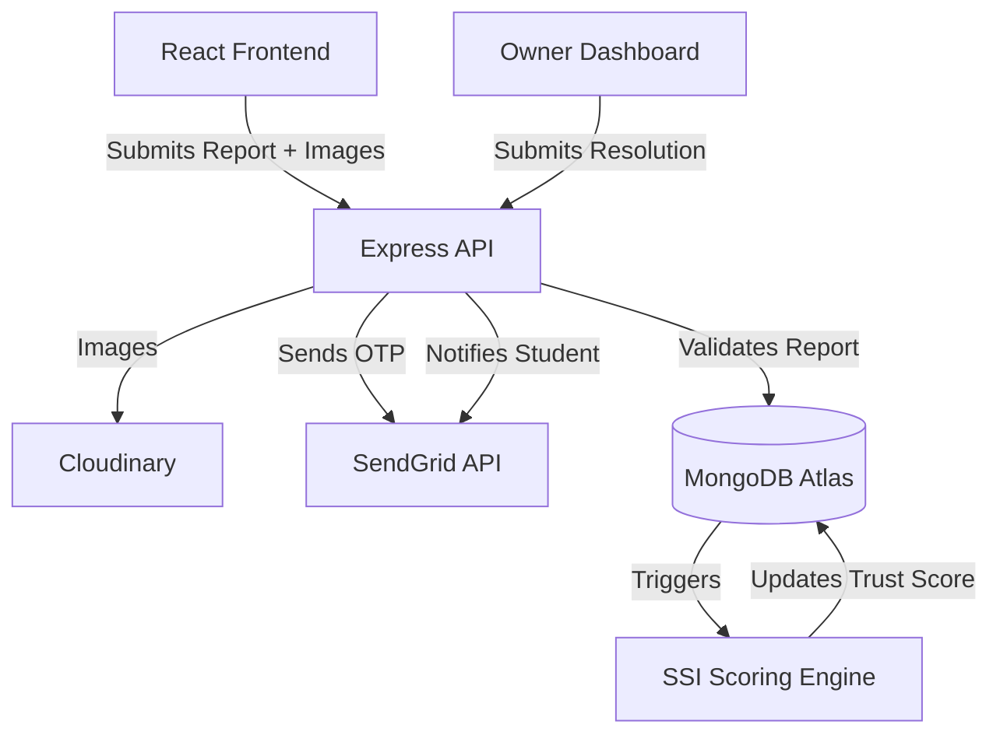

<div align="center">
  <h1>🛡️ SafeStay</h1>
  <p><strong>The Next-Generation Safety Intelligence Network for Student Accommodations in India.</strong></p>

  <a href="https://dormwatch-six.vercel.app/"><strong>Explore the Live Demo »</strong></a>
  <br />
  <br />

  <!-- Badges -->
  
  
  
  
</div>

<br />

## 📖 Overview

Finding safe, reliable student accommodation in India often relies on easily manipulated reviews, biased broker suggestions, and misleading advertisements. Students frequently face hidden issues related to food poisoning, water contamination, unhygienic conditions, and severe security threats that only become apparent after moving in.

**SafeStay** solves this by providing a verified, student-driven safety intelligence platform. We ensure authenticity by generating dynamic safety scores based entirely on real, verified student reports and owner resolutions. 

At the core of the platform is the **SafeStay Safety Index (SSI)** score. This score is dynamically computed for every property and projected onto an interactive map, allowing students to make data-driven, life-saving housing decisions before signing a lease.

---

## ✨ Key Features

- 🔐 **Universal OTP Authentication**: Seamless and secure login using SendGrid's robust email API, guaranteeing instant OTP delivery to any email address without spam blocks.
- 📊 **SafeStay Safety Index (SSI)**: A dynamic 0–100 safety score assigned to every accommodation based on the severity of student reports, 365-day time decay, and owner resolution speed. 
- 🤝 **Dual Portal Ecosystem**: 
  - **Student Portal**: Empowering students to anonymously report hazards, upload photo evidence, and explore housing safely.
  - **Owner Portal**: A dedicated dashboard for property owners to officially respond to claims, upload proof of resolution, and actively rebuild their trust scores.
- 🗺️ **Interactive Safety Map**: A visually stunning, location-based discovery engine powered by Leaflet. Features SSI-color-coded markers (Red/Yellow/Green) and live GPS integration to find the safest PGs nearby.
- ✅ **Closed-Loop Resolution Lifecycle**: Owners submit evidence to resolve reported issues, but the original reporting student holds the power to verify or dispute the fix before the penalty is lifted.
- 💬 **Multilingual & Accessibility Ready**: Designed for maximum accessibility across diverse student demographics in India.

---

## 🛠️ Technology Stack

**Frontend (Deployed on Vercel)**
- React 19 (Vite, TypeScript)
- Tailwind CSS 4 & Framer Motion (Glassmorphism & Micro-animations)
- Zustand (State Management) & React Router v7
- Leaflet & React-Leaflet (Interactive Mapping)
- shadcn/ui & Recharts (Data Visualization)

**Backend (Deployed on Render)**
- Node.js & Express.js 5
- MongoDB Atlas & Mongoose 9
- SendGrid SDK (Universal OTP & Transactional Emails)
- JWT & bcryptjs (Authentication & Security)
- Cloudinary (Image & Evidence Storage)

---

## ⚙️ How It Works (Architecture)



---

## 🚀 Getting Started Locally

### Prerequisites
- Node.js 18+ and npm
- MongoDB Atlas account (or local MongoDB)
- API Keys for Cloudinary and SendGrid.

### 1. Clone & Install
```bash
git clone https://github.com/sameekshyaranjan/DormWatch.git
cd DormWatch

# Install frontend dependencies
cd frontend
npm install

# Install backend dependencies
cd ../backend
npm install
```

### 2. Environment Variables
Create a `.env` file in the `backend` directory:
```env
MONGO_URI=mongodb+srv://<user>:<password>@cluster0.mongodb.net/safestay
JWT_SECRET=your_jwt_secret_key_minimum_32_characters
PORT=5000

# SendGrid API Configuration
SENDGRID_API_KEY=SG.your_sendgrid_api_key

# Cloudinary Configuration
CLOUDINARY_CLOUD_NAME=your_cloud_name
CLOUDINARY_API_KEY=your_api_key
CLOUDINARY_API_SECRET=your_api_secret
```

Create a `.env` file in the `frontend` directory:
```env
VITE_API_URL=http://localhost:5000
```

### 3. Run the Application
You can run both servers simultaneously:

**Terminal 1 (Backend):**
```bash
cd backend
npm run dev
```

**Terminal 2 (Frontend):**
```bash
cd frontend
npm run dev
```
Access the application locally at `http://localhost:5173`.

---

## 📁 Project Structure

```text
SafeStay/
├── frontend/                     # React Frontend (Vercel)
│   ├── src/
│   │   ├── components/         # Reusable UI components & Maps
│   │   ├── contexts/           # Auth & State Providers
│   │   ├── pages/              # Auth, Dashboards, and Discovery views
│   │   └── services/           # Axios/Fetch API integrations
│   └── vite.config.ts
├── backend/                     # Node.js Backend (Render)
│   ├── src/
│   │   ├── controllers/        # Route logic handlers
│   │   ├── middleware/         # Auth, roles, and rate limiters
│   │   ├── models/             # Mongoose schemas (User, Accommodation, Report)
│   │   ├── routes/             # Express API definitions
│   │   └── utils/              # SSI Scoring, SendGrid Emailing
│   ├── seed_pgs.js              # Database population script
│   └── server.js                # Express Server Entry Point
└── README.md
```

---

## 🔒 Security Best Practices Implemented
- **Robust JWT Handling:** Secure secrets and standard authentication practices across both portals.
- **Rate Limiting:** IP-based rate limiting on sensitive routes (login, registration) to prevent abuse and brute-force attacks.
- **Universal OTP Protection:** Prevents fake account creation while ensuring 100% deliverability through SendGrid.
- **Role-Based Access Control (RBAC):** Strict middleware checks ensuring students cannot access property owner endpoints and vice versa.
- **Data Privacy:** Passwords and sensitive metadata are stripped from API responses before reaching the client.

---

## 🤝 Contributing

We welcome contributions! To ensure a smooth process:
1. **Fork the repo** and create your branch from `main`.
2. **Code Style**: We use standard TypeScript. Please ensure your code lints correctly before submitting a PR.
3. **Pull Requests**: Provide a clear description of the problem solved and any relevant UI changes (screenshots are highly appreciated).

## 📄 License

This project is licensed under the MIT License.
