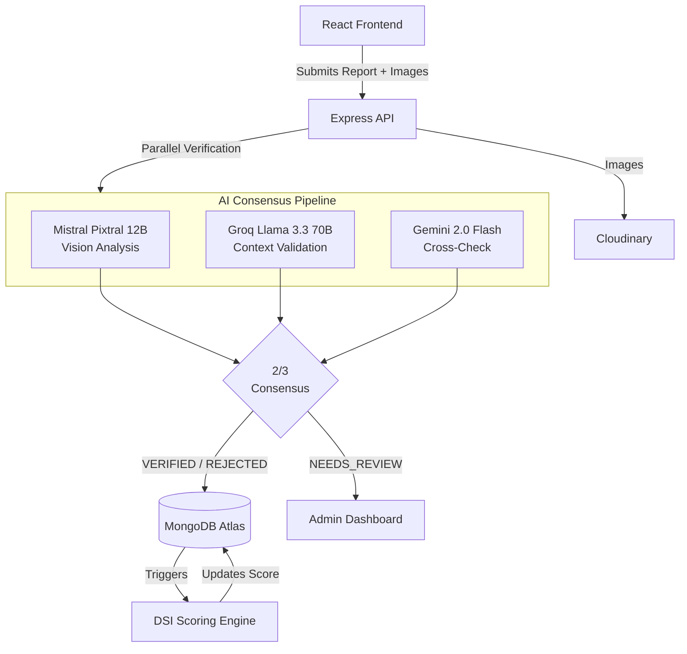

<div align="center">
  <h1>🛡️ DormWatch</h1>
  <p><strong>The AI-Powered Safety Intelligence Network for Student Accommodations in India.</strong></p>

  <a href="https://dormwatch-six.vercel.app/"><strong>Explore the Live Demo »</strong></a>
  <br />
  <br />

  <!-- Badges -->
  
  
  
  
</div>

<br />

## 📖 Overview

Finding safe, reliable student accommodation in India often relies on easily manipulated reviews, biased broker suggestions, and misleading advertisements. Students frequently face hidden issues related to food poisoning, water contamination, unhygienic conditions, and severe security threats that only become apparent after moving in.

**DormWatch** solves this by providing a verified, student-driven safety intelligence platform. We ensure authenticity by restricting reporting privileges exclusively to students with verified Indian college email addresses. Property owners must similarly pass a strict document verification process before they can list or manage accommodations.

At the core of the platform is a fully automated, **3-model AI verification pipeline** that processes every safety report (including text and images) to confirm its legitimacy before it affects an accommodation's score. The platform dynamically computes a **DormWatch Safety Index (DSI)** score for every property, projecting it onto an interactive map so students can make data-driven housing decisions.

---

## ✨ Key Features

- 🧠 **AI-Powered Report Verification**: Every report is verified in parallel by Mistral Pixtral 12B (vision), Groq Llama 3.3 70B (context), and Gemini 2.0 Flash (secondary validation). A 2-of-3 consensus is required to auto-approve reports.
- 📊 **DormWatch Safety Index (DSI)**: A dynamic 0–100 score per accommodation based on report severity, time decay (365 days), and issue resolution status. 
- 🔐 **Verified-Only Ecosystem**: Reporting is restricted to users with verified Indian college emails. Property management is restricted to owners who submit Government IDs and property deeds for admin approval.
- 🗺️ **Interactive Safety Map**: Location-based discovery using OpenStreetMap and Leaflet, featuring DSI-color-coded markers (Red/Yellow/Green), GPS integration, and radius filtering.
- ✅ **Resolution Lifecycle**: Owners can submit evidence to resolve reported issues. The original reporting student must verify the fix before the DSI penalty is reduced. 
- 💬 **Multilingual & Accessibility Support**: Available in English, Hindi, and Telugu, featuring AI-generated Text-to-Speech (ElevenLabs) audio summaries for accessibility.

---

## 🛠️ Technology Stack

**Frontend (Deployed on Vercel)**
- React 19 (Vite, TypeScript)
- Tailwind CSS 4 & Framer Motion
- Zustand (State Management) & React Router v7
- Leaflet & React-Leaflet (Mapping)
- shadcn/ui & Recharts (Data Viz)

**Backend (Deployed on Render)**
- Node.js & Express.js 5
- MongoDB Atlas & Mongoose 9
- JWT & bcryptjs (Auth & Security)
- Cloudinary (Image & File Storage)
- Nodemailer (OTP & Email Services)

**AI & Third-Party Integrations**
- Mistral API, Groq API, Gemini API
- ElevenLabs (Text-to-Speech)

---

## ⚙️ How It Works (Architecture)



---

## 🚀 Getting Started Locally

### Prerequisites
- Node.js 18+ and npm
- MongoDB Atlas account (or local MongoDB)
- API Keys for Cloudinary, Mistral, Groq, Gemini, and ElevenLabs (optional).

### 1. Clone & Install
```bash
git clone https://github.com/sameekshyaranjan/DormWatch.git
cd DormWatch

# Install frontend dependencies
cd frontend
npm install

# Install backend dependencies
cd ../backend
npm install
```

### 2. Environment Variables
Create a `.env` file in the `backend` directory based on `.env.example`:
```env
MONGO_URI=mongodb+srv://<user>:<password>@cluster0.mongodb.net/dormwatch
JWT_SECRET=your_jwt_secret_key_minimum_32_characters
PORT=5000
EMAIL_USER=your_gmail_address
EMAIL_PASS=your_gmail_app_password
# Add your Cloudinary and AI API keys here
```

Create a `.env` file in the `frontend` directory:
```env
VITE_API_URL=http://localhost:5000/api
```

### 3. Run the Application
You can run both servers simultaneously:

**Terminal 1 (Backend):**
```bash
cd backend
npm run dev
```

**Terminal 2 (Frontend):**
```bash
cd frontend
npm run dev
```
Access the application at `http://localhost:5173`.

---

## 📁 Project Structure

```text
DormWatch/
├── frontend/                     # React Frontend (Vercel)
│   ├── src/
│   │   ├── components/         # Reusable UI components
│   │   ├── contexts/           # React Context providers
│   │   ├── hooks/              # Custom React hooks
│   │   ├── pages/              # Page-level components
│   │   ├── services/           # API integration
│   │   └── stores/             # Zustand global state
│   └── vite.config.ts
├── backend/                     # Node.js Backend (Render)
│   ├── src/
│   │   ├── config/             # DB and external service configs
│   │   ├── controllers/        # Route logic handlers
│   │   ├── middleware/         # Auth, roles, and rate limiters
│   │   ├── models/             # Mongoose schemas
│   │   ├── routes/             # Express route definitions
│   │   ├── services/           # AI pipelines and voice generation
│   │   └── utils/              # Scoring logic and email templates
│   └── package.json
└── README.md
```

---

## 🔒 Security Best Practices Implemented
- **Robust JWT Handling:** Secure secrets and standard authentication practices.
- **Rate Limiting:** IP-based rate limiting on sensitive routes (login, forgot-password, reports) to prevent abuse and brute-force attacks.
- **Path Traversal Protection:** Hardened file upload and file access logic.
- **Role-Based Access Control (RBAC):** Strict middleware checks ensuring students cannot access property owner endpoints and vice versa.
- **Data Privacy:** Passwords and sensitive metadata are stripped from API responses.

---

## 🤝 Contributing

We welcome contributions! To ensure a smooth process:
1. **Fork the repo** and create your branch from `main`.
2. **Code Style**: We use standard TypeScript. Please ensure your code lints correctly before submitting a PR.
3. **Pull Requests**: Provide a clear description of the problem solved and any relevant UI changes (screenshots are highly appreciated).

## 📄 License

This project is licensed under the MIT License.
