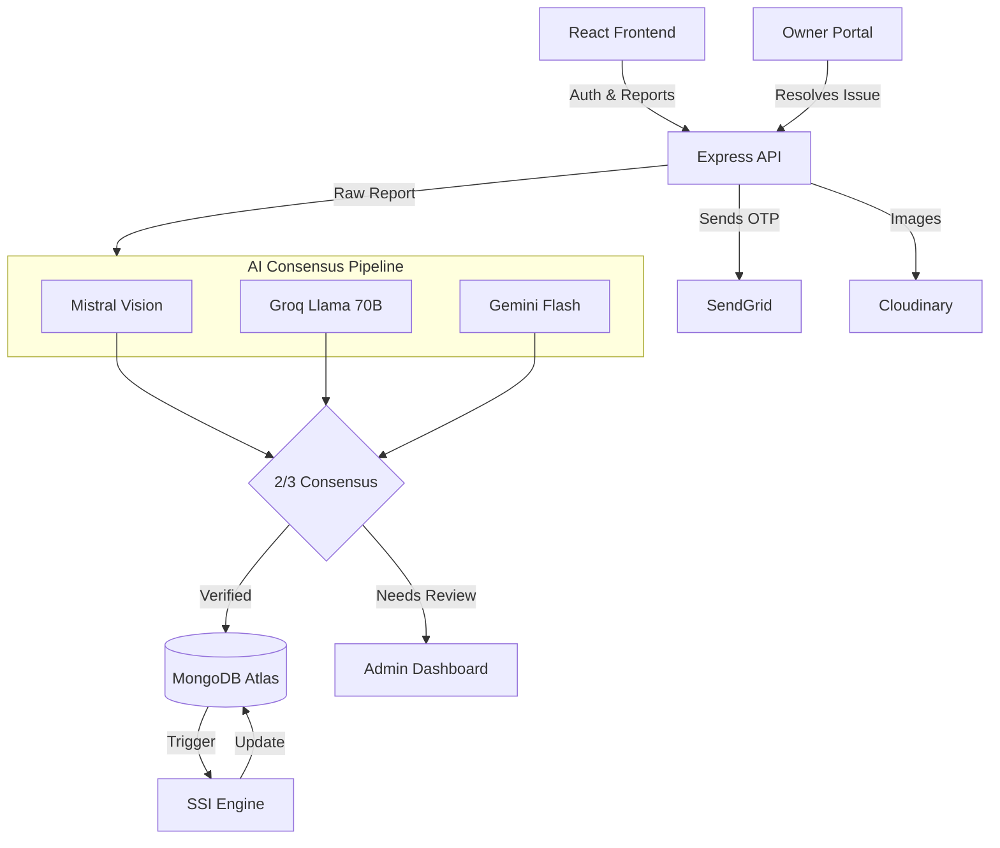

<div align="center">
  <h1>🛡️ SafeStay</h1>
  <p><strong>Verified Safety Intelligence & Resolution Network for Student Housing</strong></p>

  <!-- Badges -->
  
  
  
  
  
</div>

<br />

## Table of Contents
- [Overview](#overview)
- [Key Features](#key-features)
- [System Architecture](#system-architecture)
- [Tech Stack](#tech-stack)
- [Project Structure](#project-structure)
- [Getting Started](#getting-started)
- [API Reference](#api-reference)
- [User Roles & Permissions](#user-roles--permissions)
- [Security](#security)
- [Contributing](#contributing)
- [Roadmap](#roadmap)
- [License](#license)
- [Acknowledgments](#acknowledgments)

---

## Overview

Finding safe, reliable student accommodation in India often relies on easily manipulated reviews, biased broker suggestions, and misleading advertisements. Students frequently face hidden issues related to food safety, water quality, and severe security threats that only become apparent after moving in.

**SafeStay** (formerly DormWatch) is a verified, student-driven safety intelligence platform that solves this problem by completely replacing static, gamified reviews with a dynamic trust engine. 

Instead of writing text reviews, verified students report specific safety hazards. These reports are evaluated by a 3-model AI consensus pipeline (Mistral, Groq, Gemini) to prevent spam and verify visual evidence. Validated reports immediately impact a property's **SafeStay Safety Index (SSI)**—a dynamic 0–100 score that decays over time. Property owners are incentivized to resolve issues via a dedicated Owner Portal; when a student confirms an issue is resolved, the property's SSI score recovers.

---

## Key Features

### Implemented

*   **Universal OTP Authentication:** Passwordless, OTP-based login via SendGrid's email API, ensuring delivery to any email address without cloud-provider SMTP blocking.
*   **SafeStay Safety Index (SSI):** A dynamic scoring algorithm (0-100) applied to every property. The score calculates base trust minus penalties for active reports, factoring in issue severity and a 365-day time decay.
*   **Tri-Model AI Verification Pipeline:** When a report is filed with photo evidence, it is analyzed in parallel by Mistral Pixtral 12B (vision), Groq Llama 3.3 70B (context), and Gemini 2.0 Flash (cross-validation). A 2-of-3 consensus is required to auto-approve reports.
*   **Closed-Loop Issue Resolution:** Owners can submit photographic proof that a hazard has been resolved. The original reporting student must verify the resolution before the trust score penalty is lifted.
*   **Interactive Safety Map:** Location-based discovery powered by Leaflet, plotting accommodations using live coordinates and color-coded SSI markers (Red/Yellow/Green).
*   **Role-Based Dashboards:** Distinct React layouts and restricted API routes for Students (reporting/discovery), Owners (property management/resolution), and Admins (manual overrides/user management).

### Planned / Roadmap

*   **Real-time Notifications:** WebSockets/Socket.io integration for instant alerts when a report is countered or resolved.
*   **Advanced Analytics Dashboard:** Owner-facing charts showing SSI trends over time vs. regional averages.
*   **Mobile Application:** React Native port of the frontend for native iOS/Android experiences.

---

## System Architecture



*   **Client Layer:** React 19 SPA running on Vite, using Tailwind 3.4 for styling and Leaflet for geospatial mapping.
*   **API Layer:** Node.js/Express monolithic REST API handling routing, JWT validation, and rate-limiting.
*   **AI Layer:** Orchestrates parallel API calls to Groq, Gemini, and Mistral, aggregating the JSON responses to form a definitive verification verdict.
*   **Data Layer:** MongoDB utilizing Mongoose schemas with 2dsphere indexes for geospatial queries.

The **SSI Logic** starts every accommodation at 100 points. Penalties are subtracted based on active reports: High Severity (-15), Medium (-10), Low (-5). As reports age, the penalty decays linearly over 365 days until it reaches 0. If an owner resolves an issue and the student verifies it, the penalty is immediately removed.

---

## Tech Stack

| Category | Technology | Purpose |
| :--- | :--- | :--- |
| **Frontend** | React 19, Vite, TypeScript | SPA framework and build tooling |
| **Styling** | Tailwind CSS 3.4.19, Framer Motion | Utility-first styling and micro-animations |
| **Mapping** | Leaflet, React-Leaflet | Geospatial rendering and interactive maps |
| **Backend** | Node.js, Express.js 5 | REST API server and route orchestration |
| **Database** | MongoDB, Mongoose 9 | NoSQL data store with geospatial indexing |
| **Auth & Mail** | SendGrid API, JWT, bcryptjs | Passwordless OTP generation and delivery |
| **Storage** | Cloudinary | Secure hosting for report evidence and IDs |
| **AI / ML** | Mistral, Groq, Gemini | Multimodal image and context verification |

---

## Project Structure

```text
SafeStay/
├── backend/                  # Express API Server
│   ├── config/               # Cloudinary & environment configs
│   ├── middleware/           # JWT, Roles (Admin/Owner), Rate limiting
│   ├── models/               # Mongoose Schemas (User, Accommodation, Report)
│   ├── routes/               # API endpoints (auth.js, admin.js, etc.)
│   ├── utils/                # AI clients, SendGrid wrapper, SSI calculator
│   ├── seed_pgs.js           # Database population script for dummy data
│   └── server.js             # Main application entry point & route definitions
├── frontend/                 # React Application
│   ├── src/
│   │   ├── components/       # Reusable UI (Maps, Cards, Headers)
│   │   ├── contexts/         # React Context (AuthContext)
│   │   ├── pages/            # View components (Home, Dashboards, Auth)
│   │   └── services/         # API fetch wrappers
│   └── vite.config.ts        # Vite build configuration
└── DESIGN.md                 # Internal architectural planning document
```

---

## Getting Started

### Prerequisites
*   **Node.js**: v18.0 or higher
*   **MongoDB**: A local instance or MongoDB Atlas cluster
*   **API Keys**: SendGrid (for OTPs), Cloudinary (for image uploads)

### 1. Clone & Install

```bash
git clone https://github.com/sameekshyaranjan/DormWatch.git
cd DormWatch

# Install Frontend
cd frontend
npm install

# Install Backend
cd ../backend
npm install
```

### 2. Environment Configuration

Create `backend/.env` (Never commit this file):
```env
PORT=5000
MONGO_URI=mongodb://localhost:27017/safestay
JWT_SECRET=your_super_secret_jwt_key

# SendGrid (Required for Authentication)
SENDGRID_API_KEY=SG.your_sendgrid_key

# Cloudinary (Required for Image Uploads)
CLOUDINARY_CLOUD_NAME=your_cloud_name
CLOUDINARY_API_KEY=your_api_key
CLOUDINARY_API_SECRET=your_api_secret

# AI Providers (Optional but required for auto-verification)
MISTRAL_API_KEY=your_mistral_key
GROQ_API_KEY=your_groq_key
GEMINI_API_KEY=your_gemini_key
```

Create `frontend/.env`:
```env
VITE_API_URL=http://localhost:5000
```

### 3. Run the Development Servers

**Start the Backend:**
```bash
cd backend
npm run dev
```

**Start the Frontend:**
```bash
cd frontend
npm run dev
```
The application will be accessible at `http://localhost:5173`.

---

## API Reference

*Note: All endpoints prefixed with `/api`*

| Method | Endpoint | Description | Auth Required |
| :--- | :--- | :--- | :--- |
| **POST** | `/auth/signup` | Register a new user and trigger OTP | No |
| **POST** | `/auth/login` | Authenticate user and return JWT | No |
| **POST** | `/auth/register-owner`| Register property owner | No |
| **GET** | `/accommodations` | List properties (supports search/filter) | No |
| **GET** | `/accommodations/with-location` | Fetch lightweight GPS data for Map | No |
| **POST** | `/reports` | Submit a new safety report with images | Yes (Student) |
| **PUT** | `/reports/:id/verify` | Student verifies an owner's resolution | Yes (Student) |
| **PUT** | `/owner/reports/:id/resolve` | Owner submits proof of resolution | Yes (Owner) |
| **POST** | `/owner/accommodations` | Add a new property | Yes (Owner) |
| **GET** | `/admin/reports` | Fetch reports flagged as `NEEDS_REVIEW` | Yes (Admin) |
| **PUT** | `/admin/verify-owner/:id` | Approve pending property owner | Yes (Admin) |

---

## User Roles & Permissions

SafeStay utilizes strict Role-Based Access Control (RBAC) via Express middleware (`authMiddleware`, `adminMiddleware`, `ownerMiddleware`).

1.  **Student (Default):** Can browse accommodations, submit safety reports, upvote existing reports, and verify/dispute resolutions made by owners.
2.  **Owner:** Must undergo manual verification (submitting Gov ID/Deed) by an Admin before full access is granted. Can list accommodations, view reports targeting their properties, and submit resolutions. Owners cannot submit reports against other properties.
3.  **Admin:** Superusers capable of manually overriding the AI verification pipeline, approving/rejecting pending Owners, and banning malicious users.

---

## Security

*   **Authentication:** Passwordless OTPs via SendGrid prevent fake account creation. Sessions are managed via stateless JWTs.
*   **Rate Limiting:** `express-rate-limit` is applied to `/api/auth/*` (max 20 requests / 15m) and general `/api/*` routes to prevent DDoS and brute-force OTP attempts.
*   **Headers:** `helmet` is implemented for secure HTTP headers and cross-origin resource policies.
*   **Data Validation:** Passwords are hashed using `bcryptjs` (salt rounds: 10).
*   **CORS:** Strictly configured to only allow requests from the designated frontend domains and Vercel/Render origins.

---

## Contributing

1.  Fork the Project
2.  Create your Feature Branch (`git checkout -b feature/AmazingFeature`)
3.  Commit your Changes (`git commit -m 'Add some AmazingFeature'`)
4.  Push to the Branch (`git push origin feature/AmazingFeature`)
5.  Open a Pull Request

*Note: Ensure your code adheres to standard TypeScript conventions and does not break existing routes.*

---

## License

No license specified.

---

## Acknowledgments

*   [SendGrid](https://sendgrid.com/) for reliable transactional email delivery.
*   [Mistral AI](https://mistral.ai/), [Groq](https://groq.com/), and [Google Gemini](https://deepmind.google/technologies/gemini/) for powering the multi-model verification consensus engine.
*   [Leaflet](https://leafletjs.com/) for the open-source mapping engine.
