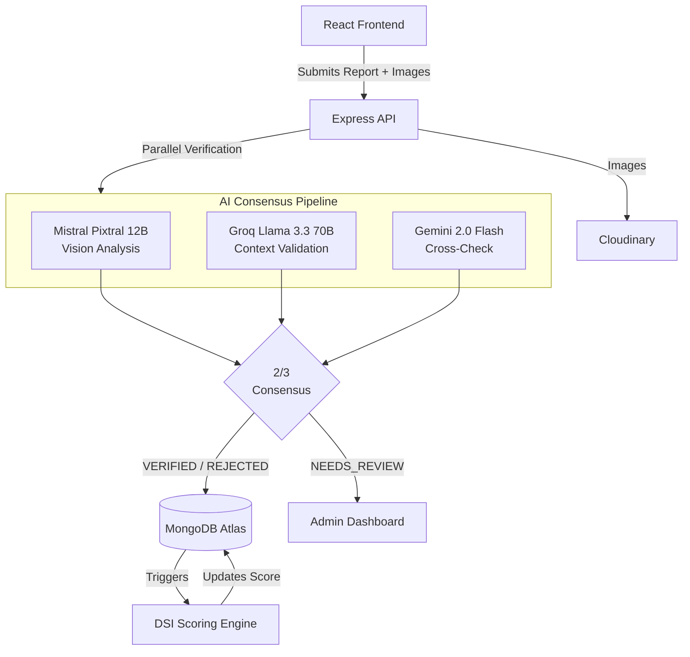

# DormWatch
> **The AI-Powered Safety Intelligence Network for Student Accommodations in India.**


## Overview

Finding safe, reliable student accommodation in India often relies on easily manipulated reviews, biased broker suggestions, and misleading advertisements. Students frequently face hidden issues related to food poisoning, water contamination, unhygienic conditions, and severe security threats that only become apparent after moving in.

**DormWatch** solves this by providing a verified, student-driven safety intelligence platform. We ensure authenticity by restricting reporting privileges exclusively to students with verified Indian college email addresses. Property owners must similarly pass a strict document verification process before they can list or manage accommodations.

At the core of the platform is a fully automated, 3-model AI verification pipeline that processes every safety report (including text and images) to confirm its legitimacy before it affects an accommodation's score. The platform dynamically computes a **DormWatch Safety Index (DSI)** score for every property, projecting it onto an interactive map so students can make data-driven housing decisions.

## Key Features

- **AI-Powered Report Verification (3-Model Consensus)**: Every report is verified in parallel by Mistral Pixtral 12B (vision), Groq Llama 3.3 70B (context), and Gemini 2.0 Flash (secondary validation). A 2-of-3 consensus is required to auto-approve reports.
- **DormWatch Safety Index (DSI)**: A dynamic 0–100 score per accommodation based on report severity, time decay (365 days), and issue resolution status. 
- **Verified-Only Ecosystem**: Reporting is restricted to users with verified Indian college emails. Property management is restricted to owners who submit Government IDs and property deeds for admin approval.
- **Interactive Safety Map**: Location-based discovery using OpenStreetMap and Leaflet, featuring DSI-color-coded markers (Red/Yellow/Green), GPS integration, and radius filtering.
- **Resolution Lifecycle**: Owners can submit evidence to resolve reported issues. The original reporting student must verify the fix before the DSI penalty is reduced. 
- **Counter-Reports & Upvotes**: Owners can dispute false claims with counter-evidence. Students can "upvote" existing reports to amplify the DSI penalty.
- **Voice Readout (ElevenLabs TTS)**: AI-generated text-to-speech audio summaries of an accommodation's safety profile.
- **Multilingual Support**: Available in English, Hindi (हिन्दी), and Telugu (తెలుగు).

## Architecture / How It Works



## Tech Stack

**Frontend**
- React 19 (Vite, TypeScript)
- Tailwind CSS 3 & Framer Motion
- Zustand (State Management) & React Router v7
- Leaflet & React-Leaflet (Mapping)
- shadcn/ui & Recharts (Data Viz)

**Backend**
- Node.js & Express.js 5
- MongoDB Atlas & Mongoose 9
- JWT & bcryptjs (Auth)
- Cloudinary (File Storage)
- Nodemailer (OTP Services)

**AI & Third-Party Services**
- Mistral API, Groq API, Gemini API
- ElevenLabs (Text-to-Speech)

## Getting Started

### Prerequisites
- Node.js 18+ and npm
- MongoDB Atlas account (or local MongoDB)
- API Keys for Cloudinary, Mistral, Groq, Gemini, and ElevenLabs (optional).

### 1. Clone & Install
```bash
git clone https://github.com/Sreekarji/safestay.git
cd safestay

# Install frontend dependencies
cd frontend
npm install

# Install backend dependencies
cd ../backend
npm install
```

### 2. Environment Variables
Create a `.env` file in the `server` directory based on `.env.example`:
```env
MONGODB_URI=mongodb://localhost:27017/dormwatch
JWT_SECRET=your_jwt_secret_key_minimum_32_characters
PORT=5000
NODE_ENV=development
CLOUDINARY_CLOUD_NAME=your_cloudinary_cloud_name
CLOUDINARY_API_KEY=your_cloudinary_api_key
CLOUDINARY_API_SECRET=your_cloudinary_api_secret
FRONTEND_URL=http://localhost:5173
GEMINI_API_KEY=your_gemini_api_key
ELEVENLABS_API_KEY=your_elevenlabs_api_key
EMAIL_USER=your_gmail_address
EMAIL_PASS=your_gmail_app_password
DEMO_MODE=false
```

Create a `.env` file in the `client` directory:
```env
VITE_API_URL=http://localhost:5000
```

### 3. Run the Application
You can use the provided Windows batch scripts for a one-click start, or run manually:

**Terminal 1 (Backend):**
```bash
cd backend
npm run dev
```

**Terminal 2 (Frontend):**
```bash
cd frontend
npm run dev
```
Access the application at `http://localhost:5173`.

## Project Structure

```text
dormwatch/
├── frontend/                     # React Frontend
│   ├── src/
│   │   ├── components/         # Reusable UI components (auth, maps, reports)
│   │   ├── contexts/           # React Context providers (Auth, Theme, Map)
│   │   ├── hooks/              # Custom React hooks
│   │   ├── i18n/               # Multilingual configuration files
│   │   ├── pages/              # Page-level components
│   │   ├── services/           # API integration and mock data
│   │   └── stores/             # Zustand global state stores
│   └── vite.config.ts
├── backend/                     # Node.js Backend
│   ├── src/
│   │   ├── config/             # DB and external service configs
│   │   ├── controllers/        # Route logic handlers
│   │   ├── middleware/         # Auth, roles, and rate limiters
│   │   ├── models/             # Mongoose schemas (User, Report, Accommodation)
│   │   ├── routes/             # Express route definitions
│   │   ├── services/           # AI pipelines and voice generation
│   │   └── utils/              # Scoring logic and email templates
│   └── .env.example
├── DESIGN.md                   # Vercel-inspired UI design spec
└── start.bat                   # One-click start script for Windows
```

## API Reference
*Note: Most routes require a valid JWT Bearer token.*

| Method | Endpoint | Description |
|---|---|---|
| `POST` | `/api/auth/register` | Register a new student account |
| `POST` | `/api/auth/login` | Authenticate and receive JWT |
| `GET` | `/api/accommodations` | Search and filter accommodations |
| `POST` | `/api/reports` | Submit a safety report (triggers AI validation) |
| `PUT` | `/api/reports/:id/resolve`| Owner submits resolution evidence |
| `GET` | `/api/admin/stats` | Retrieve platform-wide metrics (Admin only) |

## Contributing

We welcome contributions! To ensure a smooth process:
1. **Fork the repo** and create your branch from `main`.
2. **Naming convention**: Use `feat/feature-name` or `fix/bug-name`.
3. **Code Style**: We use standard TypeScript and Prettier. Please ensure your code lints correctly before submitting a PR.
4. **Pull Requests**: Provide a clear description of the problem solved and any relevant UI changes (screenshots are appreciated).

## Roadmap

- [ ] Implement automated approval/rejection notification emails to property owners during the verification process.
- [ ] Comprehensive unit and integration test suite.

## License

This project is licensed under the MIT License. 
